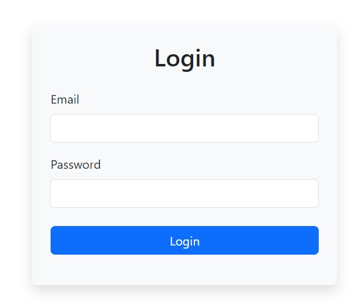

# Project Summary

## Authentication form ##

Deploy: [Click Me](https://evokss.github.io/AuthenticationForm/)

This project is a simple authentication form that allows users to log in by entering their email and password.  
It features a clean, responsive design using Bootstrap and custom CSS. 

Details

  
> * The form includes basic field validation  
> * Displays error messages for missing inputs and   
> * Simulates server interaction using a mock API request with JavaScript.

 
